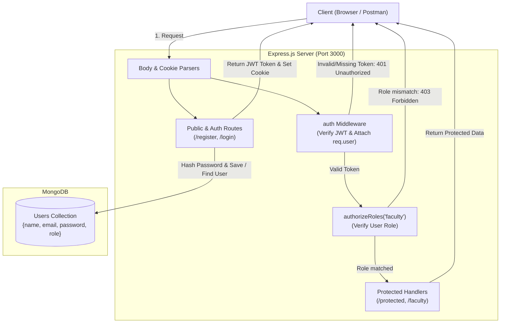
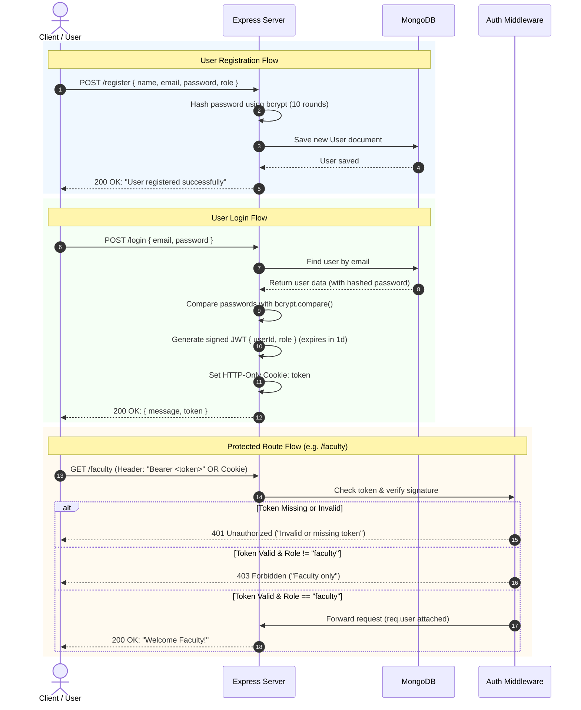

# JWT Authentication & Role-Based Access Control (RBAC) System

A robust Node.js, Express, and MongoDB authentication system implementing **JSON Web Tokens (JWT)**, password hashing with **bcrypt**, EJS views, and **Role-Based Access Control (RBAC)** (e.g., Faculty & Student roles).

---

## 🏗️ System Architecture Diagram



---

## 🔄 Authentication & Authorization Sequence Flow



---

## 📁 Project Structure

```
jwt/
├── config/
│   └── db.js                 # Database configuration
├── middleware/
│   └── auth.js               # JWT verification & role-based authorization
├── modals/
│   └── studentModals.js      # Student Schema (if applicable)
├── utils/
│   └── createToken.js        # Token helper utilities
├── views/
│   ├── login.ejs             # Login UI Form
│   └── register.ejs          # Registration UI Form
├── package.json              # Project dependencies & scripts
├── README.md                 # Complete documentation & API guide
└── server.js                 # Main Application & API routes
```

---

## 🚀 Getting Started

### 1. Install Dependencies
```bash
npm install
```

### 2. Start MongoDB
Make sure MongoDB is running locally on `mongodb://localhost:27017/jwt`.

### 3. Run the Server
```bash
# Using nodemon (development mode)
npx nodemon server.js

# Or using standard node
node server.js
```
Server runs at `http://localhost:3000`.

---

## 📡 API Endpoints Reference

### 1. Web View Routes (HTML / EJS)

| Method | Endpoint | Description |
| :--- | :--- | :--- |
| `GET` | `/register` | Renders the HTML registration form (`register.ejs`) |
| `GET` | `/login` | Renders the HTML login form (`login.ejs`) |

---

### 2. Authentication API Endpoints

#### `POST /register`
Creates a new user with an encrypted password.

- **Request Body (JSON / URL-encoded):**
```json
{
  "name": "John Doe",
  "email": "faculty@university.edu",
  "password": "secretPassword123",
  "role": "faculty"
}
```
> *Supported Roles:* `"faculty"`, `"student"`

- **Success Response (`200 OK`):**
```json
{
  "message": "User registered successfully"
}
```

---

#### `POST /login`
Authenticates user credentials and returns a signed JWT token. Also sets an `HTTP-only` cookie named `token`.

- **Request Body (JSON / URL-encoded):**
```json
{
  "email": "faculty@university.edu",
  "password": "secretPassword123"
}
```

- **Success Response (`200 OK`):**
```json
{
  "message": "Login successful",
  "token": "eyJhbGciOiJIUzI1NiIsInR5cCI6IkpXVCJ9..."
}
```

- **Error Responses:**
  - `401 Unauthorized`: User not found or invalid password.

---

### 3. Protected API Endpoints

> **Authentication Requirement:**
> Pass the token via **Header**:
> `Authorization: Bearer <YOUR_JWT_TOKEN>`
> **OR** via **Browser Cookie** (`token=<YOUR_JWT_TOKEN>`).

---

#### `GET /protected`
General protected route accessible by any logged-in user with a valid JWT.

- **Middleware:** `auth`
- **Headers:** `Authorization: Bearer <token>`
- **Success Response (`200 OK`):**
```json
{
  "message": "You are authorized to access this route",
  "user": {
    "userId": "66ce...",
    "role": "faculty",
    "iat": 1724734800,
    "exp": 1724821200
  }
}
```

---

#### `GET /faculty`
Role-restricted route accessible **only by users with `role: "faculty"`**.

- **Middlewares:** `auth`, `authorizeRoles("faculty")`
- **Headers:** `Authorization: Bearer <token>`

- **Success Response (`200 OK` for Faculty):**
```json
{
  "message": "Welcome Faculty! You have access to this protected route.",
  "user": {
    "userId": "66ce...",
    "role": "faculty",
    "iat": 1724734800,
    "exp": 1724821200
  }
}
```

- **Forbidden Response (`403 Forbidden` for non-faculty e.g. student):**
```json
{
  "success": false,
  "message": "Access denied. Role 'student' is not authorized to access this route. Allowed roles: faculty"
}
```

---

## 🛡️ Security & Authentication Highlights

1. **Password Hashing**: `bcrypt.hash(password, 10)` ensures plain passwords are never stored in the database.
2. **JWT Payload**: Contains `{ userId, role }` and expires in 1 day (`1d`).
3. **Dual Token Retrieval**: The `auth` middleware automatically checks:
   - Header: `Authorization: Bearer <token>`
   - Cookie: `req.cookies.token`
4. **Role Authorization Middleware**: `authorizeRoles(...roles)` can easily be reused on any route for multi-role security (e.g. `authorizeRoles("admin", "faculty")`).
